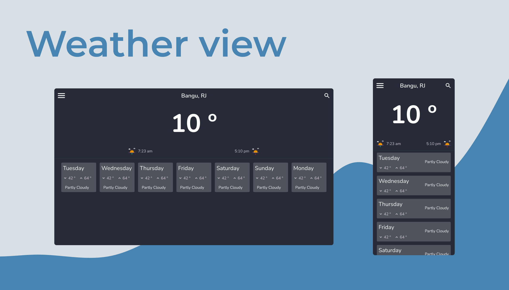

# Weather app 🌤

  

## Sobre o app
Esse era um projeto antigo e bem simples(talvez se der uma navegada pelo histórico do git ainda dê pra ver).
Resolvi pega-lo e adicionar mais funcionalidades e mudar o design. Além disso, acabei deixando ele mais interativo. 
Gostei bastante do resultado e to bastante orgulhoso por conseguir fazer meus projetos totalmente do zero :)  
## Tecnologias
- [styled-components](https://styled-components.com/)
- [RapidAPI](https://rapidapi.com/hub)
- [ReactJS](https://pt-br.reactjs.org/)

## Como usar
Usei o serviço da [netlify](https://www.netlify.com/) para hospedar o projeto, quis mudar um pouco já que tenho o costume de usar a vercel.

[Clique aqui e seja direcionado para o site](https://modest-davinci-7cc89f.netlify.app/)

## Como rodar na sua máquina
Para isso, você vai precisar de uma key da rapidAPI e se inscrever em dois serviços: 
[Yahoo Weather](https://rapidapi.com/apishub/api/yahoo-weather5/) e [Google Maps Geocoding](https://rapidapi.com/googlecloud/api/google-maps-geocoding/).
Esses dois tem uma plano gratuito então é bem tranquilo. Depois disso, basta criar uma variável de ambiente com sua chave da api e pronto!