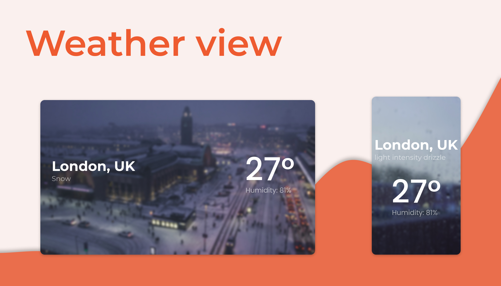

# Weather app 🌤

  

## Sobre o app
Tive a ideia de desenvolve-lo após ver alguns projetos no [dribbble](https://dribbble.com/). Infelizmente não ficou com uma UI muito bonita, prezei mais pela funcionalidade. Porém acredito que a experiência tenha sido válida.

## O que aprendi
Mexi um pouco com o [navigator](https://developer.mozilla.org/pt-BR/docs/Web/API/Navigator) para conseguir a geolocalização do usuário, além de criar um hook para ter essa funcionalidade bem controlada e reutilizável.

Além disso, esse projeto me ajudou a entender um pouco mais sobre a função [clamp](https://developer.mozilla.org/en-US/docs/Web/CSS/clamp()), nossa, achei bem confuso de início mas acredito que tenha entendido.

## Tecnologias
- [styled-components](https://styled-components.com/)
- [Open Weather API](https://openweathermap.org/)
- [ReactJS](https://pt-br.reactjs.org/)

## Como usar
Usei o serviço da [netlify](https://www.netlify.com/) para hospedar o projeto, quis mudar um pouco já que apenas hospedava na vercel.

### [Clique aqui e seja direcionado para o site](https://modest-davinci-7cc89f.netlify.app/)